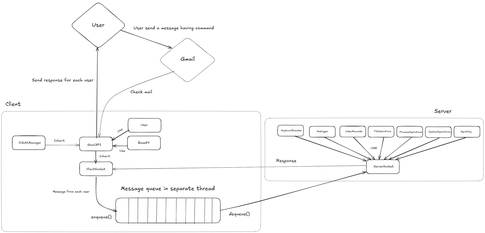

# Remote Desktop with Gmail API

This project is an socket-based client-server applications in C++. It includes both client and server implementations, along with necessary build configurations. The project also integrates with the Gmail API for email functionalities. 

This project is built for Windows.

## Files and Directories
- `build/`: Directory for build output.
- `Client/`: Directory for client source files.
  - `client.cpp`: Main source file for the client.
  - `ClientSocket.hpp`: Header file for the client socket class.
  - `ClientSocket.cpp`: Implementation file for the client socket class.
- `CMakeLists.txt`: CMake build configuration file.
- `GmailAPI/`: Directory for Gmail API related files.
  - `Base64.hpp`: Header file for Base64 encoding/decoding.
  - `Base64.cpp`: Implementation file for Base64 encoding/decoding.
  - `GmailAPI.hpp`: Header file for Gmail API class.
  - `GmailAPI.cpp`: Implementation file for Gmail API class.
  - `OAuthManager.hpp`: Header file for OAuth manager class.
  - `OAuthManager.cpp`: Implementation file for OAuth manager class.
  - `User.hpp`: Header file for User class.
- `img/`: Directory for image assets.
- `output-client/`: Directory for client output files.
- `output-server/`: Directory for server output files.
- `Readme.md`: Project documentation file.
- `run.ps1`: PowerShell script to build and run the project.
- `test.ps1`: PowerShell script to build and run the test cases.
- `Server/`: Directory for server source files.
  - `server.cpp`: Main source file for the server.
  - `ServerSocket.hpp`: Header file for the server socket class.
  - `ServerSocket.cpp`: Implementation file for the server socket class.
- `Tests/`: Directory for test files.
  - `main.cpp`: Main source file for running tests.
  - `test_base64.cpp`: Test file for Base64 encoding/decoding.
  - `test_GmailAPI.cpp`: Test file for Gmail API functionalities.
- `WindowAPI/`: Directory for Windows API related files.
  - `FileOperations.hpp`: Header file for file operations.
  - `FileOperations.cpp`: Implementation file for file operations.
  - `Keylogger.hpp`: Header file for keylogger.
  - `Keylogger.cpp`: Implementation file for keylogger.
  - `KeyboardDisabler.hpp`: Header file for keyboard disabler.
  - `KeyboardDisabler.cpp`: Implementation file for keyboard disabler.
  - `MyUtility.hpp`: Header file for utility functions.
  - `MyUtility.cpp`: Implementation file for utility functions.
  - `ProcessOperations.hpp`: Header file for process operations.
  - `ProcessOperations.cpp`: Implementation file for process operations.
  - `SystemOperations.hpp`: Header file for system operations.
  - `SystemOperations.cpp`: Implementation file for system operations.
  - `VideoRecorder.hpp`: Header file for video recorder.
  - `VideoRecorder.cpp`: Implementation file for video recorder.

## UML Diagram



## Build and run the Project

To build the project, follow these steps:

1. Install [CMake](https://cmake.org/).
2. Install [vcpkg](https://github.com/microsoft/vcpkg).
    ```sh
    git clone https://github.com/microsoft/vcpkg.git
    cd vcpkg
    .\bootstrap-vcpkg.bat
    .\vcpkg.exe integrate install
    ```
3. Install dependencies
    ```sh
    .\vcpkg install nlohmann-json curl openssl opencv
    cd ..
    ```
4. Configure the project using CMake:
    ```sh
    cmake -S . -B build
    ```
5. Build and run the project:
    ```sh
    .\run.ps1
    ```
6. Build and run test cases (optional):
    ```sh
    .\test.ps1
    ```
## Contact

For any questions or issues, please open an issue on the GitHub repository.